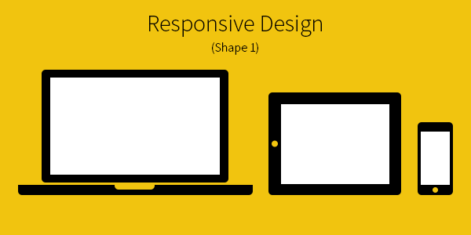

# Nothing Site

Hello there! **[Nothing site](http://www.nothingsite.com)** is clean and flat interface to do nothing.

#### Website: [www.nothingsite.com](http://www.nothingsite.com)

Twitter: [@nothingsite](https://twitter.com/nothingsite)

<mark>Dribbble: Please send me Dribbble invitation. Be sure, I will add **Nothing**.</mark>

Email: [cenk@hunili.com](mailto:cenk@hunili.com)

## Design Features

* User Experience
* Minimal and clean modern design
* Responsive (Desktop, Mobile, Blah blah...) ` Shape 1 `
* Simple content
* Easy Navigation
* Supports cross browsers

## Feedback

If you find bugs please open a ticket at [here](https://github.com/cenkcakmak/nothingsite.github.io/issues)

## License

Nothing Site is licensed under the MIT license [http://opensource.org/licenses/MIT](http://opensource.org/licenses/MIT)